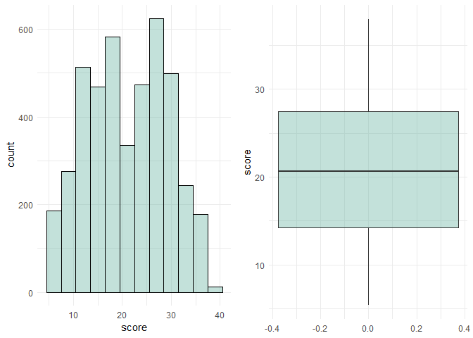
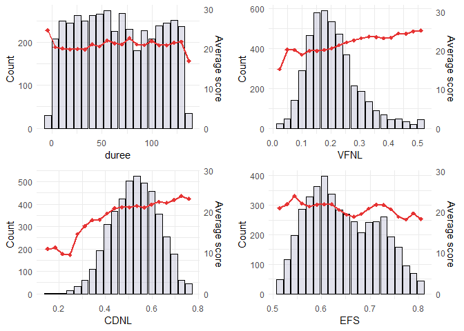
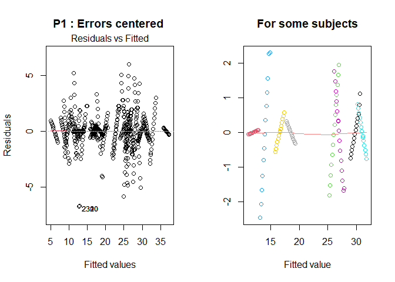
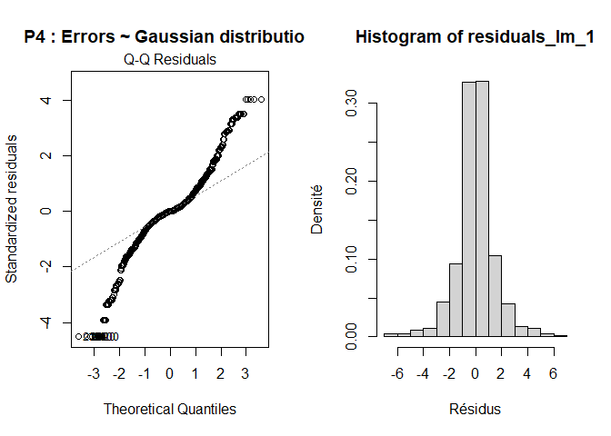
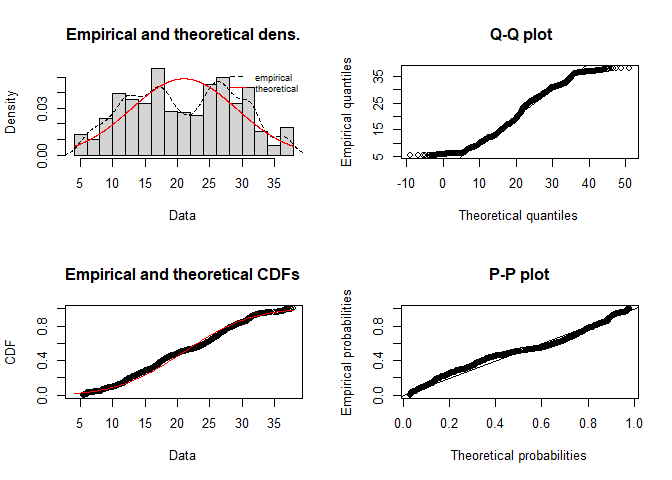
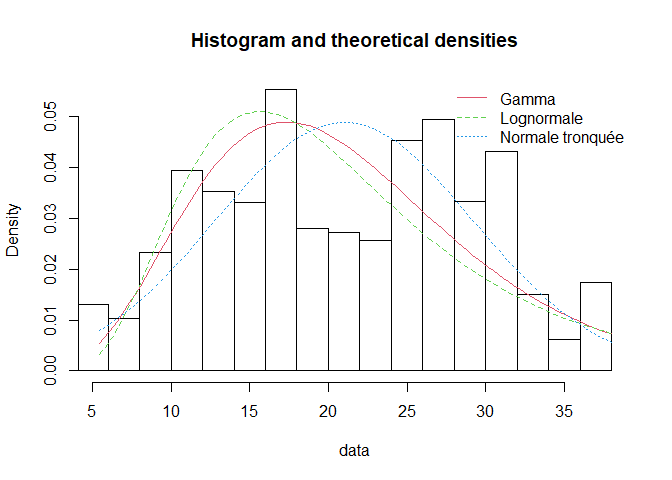

**Abstrait** 


**Objectif de l'étude**


Pour rappel, le jeu de données est composé d'une série de mesures biomédicales de *42* personnes (**sujet**) atteintes d'une maladie dégénérative à un stade précoce, recrutées pour un essai de six mois d'un dispositif de télésurveillance permettant de suivre l'évolution des symptômes dans le temps (**duree**).   
L'objectif principal de ce projet de données est de construire un modèle de prédiction du score (**score**) en fonction du temps écoulé depuis le recrutement dans l'essai (**duree**) et de tout ou partie des variables (régresseurs/facteurs) contenues dans l'ensemble de données. La variable duree est donc incluse dans l'étude.


**Dataset fourni** 


le train contient *4388* observations à partir duquel vous construirez votre modèle final. Notez que le score final doit être calculé à l'échelle (et non sur une transformation de la cible/variable à expliquer).


# **1. Visualisation dataset**

-------------------------------------


**Head dataframe :**


```
##   sujet age genre   duree  score      FF    FF.Abs  FF.RAP FF.PPQ5  FF.DDP
## 1     1  72     0  5.6431 28.199 0.00662 3.380e-05 0.00401 0.00317 0.01204
## 2     1  72     0 12.6660 28.447 0.00300 1.680e-05 0.00132 0.00150 0.00395
## 3     1  72     0 19.6810 28.695 0.00481 2.462e-05 0.00205 0.00208 0.00616
## 4     1  72     0 25.6470 28.905 0.00528 2.657e-05 0.00191 0.00264 0.00573
## 5     1  72     0 33.6420 29.187 0.00335 2.014e-05 0.00093 0.00130 0.00278
## 6     1  72     0 40.6520 29.435 0.00353 2.290e-05 0.00119 0.00159 0.00357
##        AV AV.dB AV.APQ3 AV.APQ5 AV.APQ11  AV.DDA     BTC1   BTC2    CDNL
## 1 0.02565 0.230 0.01438 0.01309  0.01662 0.04314 0.014290 21.640 0.41888
## 2 0.02024 0.179 0.00994 0.01072  0.01689 0.02982 0.011112 27.183 0.43493
## 3 0.01675 0.181 0.00734 0.00844  0.01458 0.02202 0.020220 23.047 0.46222
## 4 0.02309 0.327 0.01106 0.01265  0.01963 0.03317 0.027837 24.445 0.48730
## 5 0.01703 0.176 0.00679 0.00929  0.01819 0.02036 0.011625 26.126 0.47188
## 6 0.02227 0.214 0.01006 0.01337  0.02263 0.03019 0.009438 22.946 0.53949
##       EFS    VFNL
## 1 0.54842 0.16006
## 2 0.56477 0.10810
## 3 0.54405 0.21014
## 4 0.57794 0.33277
## 5 0.56122 0.19361
## 6 0.57243 0.19500
```

**Type des colonnes :**


```
##     sujet       age     genre     duree     score        FF    FF.Abs    FF.RAP 
## "integer" "integer" "integer" "numeric" "numeric" "numeric" "numeric" "numeric" 
##   FF.PPQ5    FF.DDP        AV     AV.dB   AV.APQ3   AV.APQ5  AV.APQ11    AV.DDA 
## "numeric" "numeric" "numeric" "numeric" "numeric" "numeric" "numeric" "numeric" 
##      BTC1      BTC2      CDNL       EFS      VFNL 
## "numeric" "numeric" "numeric" "numeric" "numeric"
```
**Stats var numériques :**


```
##      score            duree              age           genre       
##  Min.   : 5.437   Min.   : -4.263   Min.   :36.0   Min.   :0.0000  
##  1st Qu.:14.225   1st Qu.: 35.364   1st Qu.:58.0   1st Qu.:0.0000  
##  Median :20.678   Median : 67.759   Median :65.0   Median :0.0000  
##  Mean   :21.006   Mean   : 69.313   Mean   :64.6   Mean   :0.3184  
##  3rd Qu.:27.490   3rd Qu.:105.270   3rd Qu.:72.0   3rd Qu.:1.0000  
##  Max.   :37.957   Max.   :137.870   Max.   :85.0   Max.   :1.0000  
##      FF.Abs              FF.DDP               AV              AV.dB       
##  Min.   :2.250e-06   Min.   :0.000980   Min.   :0.00306   Min.   :0.0260  
##  1st Qu.:2.295e-05   1st Qu.:0.004760   1st Qu.:0.01927   1st Qu.:0.1770  
##  Median :3.435e-05   Median :0.006770   Median :0.02754   Median :0.2540  
##  Mean   :4.432e-05   Mean   :0.009095   Mean   :0.03441   Mean   :0.3139  
##  3rd Qu.:5.346e-05   3rd Qu.:0.009960   3rd Qu.:0.03977   3rd Qu.:0.3630  
##  Max.   :4.456e-04   Max.   :0.172630   Max.   :0.26863   Max.   :2.1070
```
On observe plusieurs choses d'après le summmary :  

* On a bien 42 sujets 
* On observe un minimum de durée négatif que l'on analysera par la suite
* Des scores strictement postifs compris entre 5 et 38


La plupart des variables sont des variables numériques. Nous transformons les variables catégoriques **genre** et **sujet** en facteurs via la commande : 

```r
train$sujet <- as.factor(train$sujet)
train$genre <- as.factor(train$genre)
levels(train$genre) <- c('M', 'F')

testX$sujet <- as.factor(testX$sujet)
testX$genre <- as.factor(testX$genre)
levels(testX$genre) <- c('M', 'F')
```


Nous vérifions également que nous n'avons pas de valeurs NA dans notre dataset :  

```r
listMissingColumns <- colnames(train)[apply(train, 2, anyNA)]
print(listMissingColumns) 
```

```
## character(0)
```

Enfin nous vérifions s'il n'y a pas de lignes dupliquées : 


```r
cat('Nb de lignes dupliquées : ', sum(duplicated(train)))
```

```
## Nb de lignes dupliquées :  0
```


# **2. Analyse descriptive**
## **2.1 Etude de la variable score**
Observons dans un premier temps la distribution de la variable réponse **score** :  

**Valeur de quantiles :** 


```
##    Min. 1st Qu.  Median    Mean 3rd Qu.    Max. 
##   5.437  14.225  20.678  21.006  27.490  37.957
```

**Histogramme et boxplot : **
<!-- -->

On observe que la distribution est relativement symétrique et strictement positive. 
Nous testons dans un premier temps les modèles linéaires gaussiens dans l'objectif d'étudier les résidus afin de valider ou non les hypothèses de Gauss-Markov. 
Nous testerons par la suite des GLM à lois continues positives (Gamma, log-normale, normale tronquée, ...).


## **2.2 Etude variable duree**

Vérifions également la distribution de **durée** :


```
##    Min. 1st Qu.  Median    Mean 3rd Qu.    Max. 
##  -4.263  35.364  67.759  69.313 105.270 137.870
```

<!-- -->

Nous observons des durées négatives, affichons les sujets concernés par ces durées : 


```
##  [1] 34 34 34 34 34 34 42 42 42 42 42 42
```


```
##   sujet age genre    duree  score
## 1    34  59     M -3.31250 29.291
## 2    34  59     M  3.27500 28.712
## 3    34  59     M 10.58100 28.070
## 4    34  59     M 17.57700 27.455
## 5    42  61     M -4.26250 19.725
## 6    42  61     M  0.39583 20.026
## 7    42  61     M  9.71040 20.626
## 8    42  61     M 16.70800 21.078
```

Nous observons qu'il s'agit uniquement des sujets *34* et *42* et de leur premières valeurs. Nous partons du principe que ces valeurs négatives correspondent à des analyses antérieurs au début du test et décidons de les conserver (par exemple de patients qui ont changé de médecins et ont apporté leurs anciens bilans pour l'étude). Etant de plus des cas marginales, nous décidons de les conserver. 


**Comparaison jeu de test**

Nous comparons les valeurs de durées pour chaque sujets entre le *train set* et le *test set* fourni : 

<!-- -->

Via un graphique stripchart, nous voyons que pour tous les sujets, les durées du jeu de test sont dans la continuité de celles présentes dans le train.

Enfin vérifions si tous les sujets du jeu de test se retrouvent sur le train : 


```r
all(testX$sujet %in% train$sujet)
```

```
## [1] TRUE
```

**Valeurs de durée dupliquées**

En explorant le dataset, nous observons qu'un même sujet apparait plusieurs fois avec la même durée. Par exemple le sujet 1 possède plusieurs durées à environ 5.645 (arrondi) :   


```
##   sujet age genre  duree  score      FF    FF.Abs  FF.RAP FF.PPQ5  FF.DDP
## 1     1  72     M 5.6431 28.199 0.00662 3.380e-05 0.00401 0.00317 0.01204
## 2     1  72     M 5.6431 28.199 0.00348 1.547e-05 0.00124 0.00133 0.00372
## 3     1  72     M 5.6438 28.199 0.00413 2.067e-05 0.00173 0.00165 0.00520
## 4     1  72     M 5.6451 28.199 0.00217 1.144e-05 0.00086 0.00099 0.00259
## 5     1  72     M 5.6458 28.199 0.00294 1.456e-05 0.00121 0.00125 0.00362
## 6     1  72     M 5.6458 28.199 0.00250 1.278e-05 0.00110 0.00090 0.00331
##        AV AV.dB AV.APQ3 AV.APQ5 AV.APQ11  AV.DDA     BTC1   BTC2    CDNL
## 1 0.02565 0.230 0.01438 0.01309  0.01662 0.04314 0.014290 21.640 0.41888
## 2 0.01192 0.113 0.00411 0.00463  0.00949 0.01234 0.009238 27.927 0.37340
## 3 0.01282 0.125 0.00555 0.00651  0.01103 0.01665 0.030790 26.641 0.50911
## 4 0.00798 0.072 0.00271 0.00354  0.00781 0.00812 0.004547 30.749 0.41216
## 5 0.01058 0.098 0.00459 0.00495  0.00888 0.01377 0.014919 27.530 0.40986
## 6 0.00631 0.058 0.00222 0.00259  0.00579 0.00665 0.003822 32.102 0.31053
##       EFS     VFNL entier
## 1 0.54842 0.160060      5
## 2 0.52499 0.170660      5
## 3 0.53637 0.251830      5
## 4 0.54572 0.094704      5
## 5 0.53572 0.166350      5
## 6 0.52767 0.065937      5
```

Nous observons également que la variance des variables pour cette même durée est relativement élevée. Il est difficile sans avis du métier de savoir si ces observations constituent des anomalies (et encore plus quelles lignes garder si c'est le cas !). 
Nous supposons qu'il s'agisse d'un seul prélevement et que les résultats sont observés à par exemple plusieurs heures à la même journée.  
Nous partons du principe alors que ces lignes ne sont pas des erreurs du dataset malgré le caractère étrange de celles-ci et les conservons donc. 


## **2.3 Etude de l'age** 

<!-- -->

La variable **age** est comprise entre 36 et 85, avec certaines disproportions par tranches.  
Nous décidons de segmenter la variable **age** via les tranches suivantes : 

<!-- -->


## **2.4 Etude bivariée**
#### **Variables Numériques**

Dans cette partie nous souhaitons étudier la relation entre le **score** et les features. 
Comme notre jeu de données ne contient pas énormément de variables nous pouvons explorer graphiquement ces dernières. 
Pour les variables numériques, nous crééons un graphique de Pareto qui se lit de cette manière :   

* L'histogramme en gris represente la distribution de la variable numérique avec comme échelle *Count* à gauche. 
* La ligne rouge represente la moyenne de score des individus présents dans chaque bins des histogrammes, avec l'échelle *Average score* à droite. 

Notre objectif est d'observer d'un premier coup d'oeil des relations potentiellement importantes avec notre variable target. 

<!-- --><!-- --><!-- -->

Pour les variables affichées, il est difficile d'observer une tendance forte avec le **score**, seulement quelques relations légèrement monotones pour certaines d'entre elles. 

#### **Variables catégoriques :**

**Genre**

Le dataset comporte globalement plus d'hommes que de femmes, nous pouvons le vérifier : 


```
##   Genre Frequence
## 1     M      2991
## 2     F      1397
```


<!-- -->


<!-- -->

On observe que le premier et deuxième quantiles de score sont relativement différents entre les hommes et les femmes.
Egalement les distributions de score pour les 2 genres n'ont pas d'outliers et ne sont pas asymétriques. 

<!-- -->

Concernant les sujets, on observe que leurs scores sont très différents entre eux.
Notons également pour certains sujets la présence d'outliers parmi leurs scores ( > 1.5 l'IQR). 

## **2.5 Corrélations des variables**
<!-- -->

Nous observons ici des corrélations élevées entre certaines variables dépendantes, en particulier celles relatives à la fréquence vocale (FF) et à l'amplitude (AA)
Cela suggère l'existence d'informations redondantes au sein des variables qui peuvent affecter les coefficients finaux.
Nous pouvons l'observer plus clairement avec un graphique de corrélation ordonné :

<!-- -->

Nous observons 2 blocs de variables fortement corrélées entre elles (FF et AA en bleu foncée). Notons aussi les faibles corrélations entre le **score** et les variables indépendantes.   
Regardons les valeurs exactes de ces corrélations : 


```
##               score        duree          FF       FF.Abs      FF.RAP
## score    1.00000000  0.043259503  0.09728728  0.069739318  0.08196194
## duree    0.04325950  1.000000000 -0.01761963 -0.005680196 -0.01962437
## FF       0.09728728 -0.017619628  1.00000000  0.853081886  0.98540887
## FF.Abs   0.06973932 -0.005680196  0.85308189  1.000000000  0.83409008
## FF.RAP   0.08196194 -0.019624366  0.98540887  0.834090075  1.00000000
## FF.PPQ5  0.08536888 -0.011969800  0.96912718  0.778038608  0.94946533
## FF.DDP   0.08198367 -0.019625942  0.98541099  0.834092943  0.99999966
## AV       0.10647160 -0.027993195  0.70999223  0.643036148  0.68091473
## AV.dB    0.11304099 -0.027933494  0.71488909  0.647414852  0.68261631
## AV.APQ3  0.08510384 -0.021184613  0.65909192  0.616172315  0.64327651
## AV.APQ5  0.09697639 -0.029412403  0.69407826  0.614730253  0.65866862
## AV.APQ11 0.14383000 -0.047668184  0.64782643  0.578316504  0.60547860
## AV.DDA   0.08510476 -0.021179724  0.65909035  0.616169506  0.64327452
##              FF.PPQ5      FF.DDP         AV       AV.dB     AV.APQ3     AV.APQ5
## score     0.08536888  0.08198367  0.1064716  0.11304099  0.08510384  0.09697639
## duree    -0.01196980 -0.01962594 -0.0279932 -0.02793349 -0.02118461 -0.02941240
## FF        0.96912718  0.98541099  0.7099922  0.71488909  0.65909192  0.69407826
## FF.Abs    0.77803861  0.83409294  0.6430361  0.64741485  0.61617232  0.61473025
## FF.RAP    0.94946533  0.99999966  0.6809147  0.68261631  0.64327651  0.65866862
## FF.PPQ5   1.00000000  0.94946955  0.7297561  0.73122402  0.66995822  0.73120571
## FF.DDP    0.94946955  1.00000000  0.6809133  0.68261610  0.64327438  0.65866480
## AV        0.72975606  0.68091327  1.0000000  0.99338411  0.98022694  0.98476617
## AV.dB     0.73122402  0.68261610  0.9933841  1.00000000  0.96935961  0.97773897
## AV.APQ3   0.66995822  0.64327438  0.9802269  0.96935961  1.00000000  0.96160636
## AV.APQ5   0.73120571  0.65866480  0.9847662  0.97773897  0.96160636  1.00000000
## AV.APQ11  0.66726351  0.60547926  0.9338580  0.93498486  0.88257549  0.93808712
## AV.DDA    0.66995693  0.64327239  0.9802266  0.96935947  0.99999998  0.96160688
##             AV.APQ11      AV.DDA
## score     0.14383000  0.08510476
## duree    -0.04766818 -0.02117972
## FF        0.64782643  0.65909035
## FF.Abs    0.57831650  0.61616951
## FF.RAP    0.60547860  0.64327452
## FF.PPQ5   0.66726351  0.66995693
## FF.DDP    0.60547926  0.64327239
## AV        0.93385798  0.98022657
## AV.dB     0.93498486  0.96935947
## AV.APQ3   0.88257549  0.99999998
## AV.APQ5   0.93808712  0.96160688
## AV.APQ11  1.00000000  0.88257525
## AV.DDA    0.88257525  1.00000000
```

En regardant ces valeurs, il est clair que toutes les variables blocs FF et AA sont corrélées (presque 70% pour la majorité). Egalement nous avons des corrélations de quasiment 1 (0.99) au sein des blocs FF et AA. Enfin la variable **BTC2** ne forme pas un bloc mais est très corrélée négativement avec la majorité des varibales. 

Par la suite dans une de nos méthodes de sélections de variables. Nous ne choisirons qu'une variable, celle la plus corrélée avec le score, pour chaque bloc (FF et AA). Ici nous remarquons qu'il s'agit pour le bloc FF de la variable **FF** et pour le bloc AA la variable **AV.APQ11**. 

Nous calculons également pour les variables catégorielles, à savoir **sujet**, **age** (discretisé) et **genre** le coefficient V de Cramer.
Le V de Cramer est une mesure d’association, basée sur la statistique du χ2 de Pearson, avec des valeurs comprises entre 0 et 1. Nous obtenons la matrice de corrélation suivante : 

<!-- -->

On observe alors des valeurs d'association maximale pour la variable **sujet** par rapport aux autres variables catégorielles. Ce qui parait cohérent puisque l'information de l'age et du genre sont déjà capté par la variable **sujet**.


## **2.6 Focus sur score vs duree**
<!-- -->

Aucune relation n'apparaît à première vue lorsque l'on regarde le score par rapport à la durée seule sur **A**.   
Cependant, lorsque nous représentons la durée pour certains sujets spécifiques sur **B**, elle semble suivre une tendance qui dépend de la durée, qu'elle soit croissante, décroissante ou constante.  

Cela est principalement dû au fait que notre jeu de données est un *"panel dataset"*, avec les mêmes individus (**sujet**) plusieurs fois en tant qu'observation, mais à des instants différents (**duree**). 
Cela peut être problématique dans la partie modélisation car cela entraîne souvent une autocorrélation (résidus dépendants les uns des autres), on vérifiera cette hypothèse lors de la construction de nos modèles. 
Si cela est avérée,les modèles linéaires ne serons pas adaptés à ce type de problème, et nous devrons nous tourner vers d'autres solutions.  

Enfin, notons que la tendance linéaire par sujet semble changer à partir d'une certaine durée (environ 70%).


## **2.7 Création des nouvelles variables avec ACP:**

Comme nous l'avons observé, nos variables cliniques sont très corrélées entre elles, nous crééons donc de nouvelles variables comme combinaisons linéaires de ces dernières. 


```
## Importance of first k=5 (out of 16) components:
##                          PC1     PC2     PC3     PC4     PC5
## Standard deviation     4.350 0.14767 0.07657 0.07184 0.05342
## Proportion of Variance 0.998 0.00115 0.00031 0.00027 0.00015
## Cumulative Proportion  0.998 0.99920 0.99951 0.99978 0.99993
```

En regardant les composantes principales et leurs proportions de variances, on ne garde que la première car celle-ci conserve déjà plus de 99 % de la variance expliquée.   


## **2.8 Split des données**

Nous divisons le train set original en base d'apprentissage, de validation et de test avec une proportion respective de *70/10/20* %, pour évaluer la performance du modèle sur une partie de notre jeu de données.   
Le set de validation nous permet de selectionner et tuner les modèles entre eux en limitant le risque d'overfit. 
Le set de test quant à lui nous permettra d'estimer sans biais l'erreur attendu sur le set sans labels, et de conclure sur l'efficacité de notre modèle retenu.  
Egalement Comme il s'agit d'un panel dataset, il est important de ne pas séparer simplement de manière aléatoire le jeu de validation et le jeu d'entrainement.  
Nous voulons tenir compte des ordres chronologiques des analyses. Pour cela nous calculons le quantile 70% et 80% pour chaque sujet puis repartissons les sets de cette manière :  


* inférieur à 70% quantile,  *set d'apprentissage*       
* compris entre 70% et 80%,  *set de validation*       
* supérieur à 80%,  *set de test*     


```r
quantiles_1 <- train_selected %>%
  group_by(sujet) %>%
  summarize(value_quantile_1 = quantile(duree, 0.7))

quantiles_2 <- train_selected %>%
  group_by(sujet) %>%
  summarize(value_quantile_2 = quantile(duree, 0.8))

train_result <- train_selected %>%
  left_join(quantiles_1, by = "sujet")
train_result <- train_result %>%
  left_join(quantiles_2, by = "sujet")

apprentissage <- train_result %>% 
  filter(duree <=value_quantile_1)
validation <- train_result %>% 
  filter(duree > value_quantile_1 & duree <= value_quantile_2)
test <- train_result %>% 
  filter(duree >value_quantile_2)

drop <- c("value_quantile_1","value_quantile_2")
apprentissage = apprentissage[,!(names(apprentissage) %in% drop)]
validation = validation[,!(names(validation) %in% drop)]
test = test[,!(names(test) %in% drop)]
```


# **3. Modélisation **

## **3.1 Modèles LM** 
Dans cette partie, nous allons dans un premier temps construire 3 modèles linéaires "naïfs"  :

* Le premier avec seulement ***duree*** et ***sujet***    
* Le deuxième avec toutes les variables sauf ***sujet***   
* Le troisième avec toutes les variables    

#### **Modèle réduit à l'intercept**

Nous construisons le modèle réduit à l'intercept qui servira de comparaison pour les modèles suivant.


```
## 
## Call:
## lm(formula = score ~ 1, data = apprentissage)
## 
## Residuals:
##      Min       1Q   Median       3Q      Max 
## -14.7297  -7.2426  -0.3126   6.5304  16.3214 
## 
## Coefficients:
##             Estimate Std. Error t value Pr(>|t|)    
## (Intercept)  20.6666     0.1444   143.1   <2e-16 ***
## ---
## Signif. codes:  0 '***' 0.001 '**' 0.01 '*' 0.05 '.' 0.1 ' ' 1
## 
## Residual standard error: 8.047 on 3103 degrees of freedom
```

#### **Modèle : score ~ duree + sujet**

Nous testons un premier modèle linéaire avec comme seules variables explicatives **duree** et **sujet**.
Notons que ce summary n'affiche pas l'integralité des coefficients (via une fonction de display custom) des sujets dans un soucis de lisibilité : 

```r
model_lm_1 <- lm(formula= score~ sujet + duree ,data=apprentissage)
my.summary.lm(summary(model_lm_1),my.rows = c(2:4, 10, 20, 30, 41:43))
```

```
## 
## Call:
## lm(formula = score ~ sujet + duree, data = apprentissage)
## 
## Residuals:
##     Min      1Q  Median      3Q     Max 
## -6.7473 -0.5473  0.0025  0.5658  6.0380 
## 
## Coefficients:
##           Estimate Std. Error t value Pr(>|t|)    
## sujet2  -17.771440   0.239051 -74.342  < 2e-16 ***
## sujet3   -3.733841   0.236789 -15.769  < 2e-16 ***
## sujet4  -15.822990   0.239872 -65.964  < 2e-16 ***
## sujet10 -17.796522   0.240675 -73.944  < 2e-16 ***
## sujet20 -18.486207   0.244070 -75.741  < 2e-16 ***
## sujet30  -1.152170   0.241499  -4.771 1.92e-06 ***
## sujet41   3.212556   0.234681  13.689  < 2e-16 ***
## sujet42  -6.898739   0.234761 -29.386  < 2e-16 ***
## duree     0.018823   0.001011  18.610  < 2e-16 ***
## ---
## Signif. codes:  0 '***' 0.001 '**' 0.01 '*' 0.05 '.' 0.1 ' ' 1
## 
## Residual standard error: 1.507 on 3061 degrees of freedom
## Multiple R-squared:  0.9654,	Adjusted R-squared:  0.9649 
## F-statistic:  2034 on 42 and 3061 DF,  p-value: < 2.2e-16
```

```
## RMSE train :  1.4964
```

```
## RMSE validation :  2.635391
```

On observe un meilleur RSE que le modèle réduit à l'intercept, ainsi qu'un R carré elevé.
Le RMSE est également plus élevé dans le set de validation, nous investiguerons cet écart par la suite. 


#### **Modèle : score ~ . - sujet**


```r
model_lm_2 <- lm(formula= score ~. - sujet - PC1 ,data=apprentissage) # -PC1 on enlève la composante principale custom créee précédemment
summary(model_lm_2)
```

```
## 
## Call:
## lm(formula = score ~ . - sujet - PC1, data = apprentissage)
## 
## Residuals:
##      Min       1Q   Median       3Q      Max 
## -28.1425  -6.1373  -0.7632   6.1674  18.8836 
## 
## Coefficients:
##               Estimate Std. Error t value Pr(>|t|)    
## (Intercept)  3.715e+01  3.099e+00  11.985  < 2e-16 ***
## duree        7.360e-03  5.074e-03   1.451 0.147014    
## FF           5.042e+02  2.171e+02   2.322 0.020305 *  
## FF.Abs      -3.368e+04  8.852e+03  -3.804 0.000145 ***
## FF.RAP      -1.276e+04  5.048e+04  -0.253 0.800433    
## FF.PPQ5     -2.861e+02  1.798e+02  -1.591 0.111799    
## FF.DDP       4.159e+03  1.683e+04   0.247 0.804816    
## AV           2.164e+02  7.250e+01   2.986 0.002852 ** 
## AV.dB       -9.441e+00  5.636e+00  -1.675 0.093995 .  
## AV.APQ3      2.559e+04  5.036e+04   0.508 0.611443    
## AV.APQ5     -1.160e+02  6.147e+01  -1.887 0.059242 .  
## AV.APQ11     7.974e+01  2.585e+01   3.084 0.002059 ** 
## AV.DDA      -8.614e+03  1.679e+04  -0.513 0.607903    
## BTC1        -1.899e+01  6.468e+00  -2.937 0.003343 ** 
## BTC2        -3.622e-01  7.218e-02  -5.018 5.52e-07 ***
## CDNL         7.174e+00  1.913e+00   3.751 0.000179 ***
## EFS         -2.360e+01  2.361e+00  -9.999  < 2e-16 ***
## VFNL         1.534e+01  3.069e+00   4.998 6.10e-07 ***
## ---
## Signif. codes:  0 '***' 0.001 '**' 0.01 '*' 0.05 '.' 0.1 ' ' 1
## 
## Residual standard error: 7.616 on 3086 degrees of freedom
## Multiple R-squared:  0.1092,	Adjusted R-squared:  0.1043 
## F-statistic: 22.25 on 17 and 3086 DF,  p-value: < 2.2e-16
```

```
## RMSE train :  7.59365
```

```
## RMSE validation :  8.142571
```

Les résultats sont bien moins satisfaisant que le premier modèle précédent avec un RSE proche du model null
Le RMSE quant à lui est de plus de 7, ce qui est loin d'être bon au vu de la plage de **score** allant de 5 à 38.
Nous montrons ainsi l'importance de la variable **sujet** dans notre jeu de données. Nous testons sur un dernier modèle avec toutes les variables pour valider notre hypothèse. 


#### **Modèle : score ~ .**


```r
model_lm_3 <- lm(formula= score ~. - PC1 ,data=apprentissage) # -PC1 on enlève la composante principale custom créee précédemment
my.summary.lm(summary(model_lm_3),my.rows = c(2:4, 41:59))
```

```
## 
## Call:
## lm(formula = score ~ . - PC1, data = apprentissage)
## 
## Residuals:
##     Min      1Q  Median      3Q     Max 
## -6.9821 -0.5794 -0.0081  0.6172  6.1088 
## 
## Coefficients:
##            Estimate Std. Error t value Pr(>|t|)    
## sujet2   -1.711e+01  2.899e-01 -59.014  < 2e-16 ***
## sujet3   -3.749e+00  2.378e-01 -15.763  < 2e-16 ***
## sujet4   -1.533e+01  2.704e-01 -56.701  < 2e-16 ***
## sujet41   3.838e+00  2.605e-01  14.736  < 2e-16 ***
## sujet42  -6.631e+00  2.440e-01 -27.171  < 2e-16 ***
## duree     1.874e-02  1.010e-03  18.550  < 2e-16 ***
## FF       -1.030e+02  4.594e+01  -2.242  0.02501 *  
## FF.Abs    8.942e+02  2.198e+03   0.407  0.68411    
## FF.RAP   -5.247e+03  9.947e+03  -0.527  0.59790    
## FF.PPQ5   1.112e+01  3.956e+01   0.281  0.77868    
## FF.DDP    1.809e+03  3.316e+03   0.546  0.58542    
## AV        3.263e+01  1.482e+01   2.203  0.02769 *  
## AV.dB     4.521e-01  1.156e+00   0.391  0.69566    
## AV.APQ3   1.216e+04  9.938e+03   1.224  0.22119    
## AV.APQ5  -1.172e+01  1.248e+01  -0.938  0.34811    
## AV.APQ11 -1.262e+01  5.333e+00  -2.367  0.01801 *  
## AV.DDA   -4.063e+03  3.313e+03  -1.227  0.22007    
## BTC1     -7.586e-01  1.471e+00  -0.516  0.60623    
## BTC2      5.573e-02  1.857e-02   3.001  0.00272 ** 
## CDNL     -4.950e-01  4.754e-01  -1.041  0.29781    
## EFS      -2.044e+00  8.663e-01  -2.359  0.01837 *  
## VFNL     -5.220e-01  7.017e-01  -0.744  0.45700    
## ---
## Signif. codes:  0 '***' 0.001 '**' 0.01 '*' 0.05 '.' 0.1 ' ' 1
## 
## Residual standard error: 1.493 on 3045 degrees of freedom
## Multiple R-squared:  0.9662,	Adjusted R-squared:  0.9656 
## F-statistic:  1501 on 58 and 3045 DF,  p-value: < 2.2e-16
```


```
## RMSE train :  1.478843
```

```
## RMSE validation :  2.614845
```

Bien que légérement meilleur, nous obtenons des résultats similaire à notre premier modèle sur le RMSE du test et du train. 


#### **Modèle méthode pas à pas**

Ici nous testons de selectionner nos variables via une méthode stepwise.

```r
lm_all <- lm(formula= score ~ . - PC1  ,data=apprentissage)
lm_both <- step(lm_all, direction="both", trace=0)
#my.summary.lm(summary(lm_both),my.rows = c(2:4, 41:length(lm_both$coefficients)))
```


```
## RMSE train :  1.48005
```

```
## RMSE validation :  2.619569
```

#### **Modèle méthodes régularisations**

Nous testons dans cette partie plusieurs méthodes de régularisation à savoir Lasso, Ridge et ElasticNet.  

**Lasso**

<!-- -->

Via la méthode de Lasso, nous voyons que le tuning du paramètre d'erreur ne semble qu'augmenter le RMSE. Nous pouvons le vérifier avec : 


```
##   alpha lambda     RMSE  Rsquared      MAE     RMSESD  RsquaredSD      MAESD
## 1     1  0e+00 1.523306 0.9641989 1.015897 0.03785984 0.002145589 0.01269556
## 2     1  1e-04 1.523306 0.9641989 1.015897 0.03785984 0.002145589 0.01269556
## 3     1  1e-03 1.523306 0.9641989 1.015897 0.03785984 0.002145589 0.01269556
## 4     1  1e-02 1.545727 0.9632176 1.047096 0.03512266 0.002119044 0.01444544
## 5     1  1e-01 1.828408 0.9537028 1.309967 0.04574245 0.002749391 0.03188981
## 6     1  2e-01 2.232081 0.9419766 1.737093 0.05943870 0.003619165 0.04118411
```

**Ridge**

<!-- -->

Nous observons le même phénomène pour la régresion Ridge. 


**Elastic Net**

<!-- -->


```
## RMSE train :  1.480104
```

```
## RMSE validation :  2.615213
```


### **Résidus :  score ~ duree + sujet**

Nous voyons que globalement les résultats sont très similaires entre les modèles, avec un RMSE globalement plus élevé pour la validation. 
De plus, Le modèle avec seulement 2 variables obtient quasiment les mêmes performances. Analysons les résidus de ce dernier :


*P1*
<!-- -->

Bien que les résidus soient centrées en 0, nous pouvons observer des patternes dans ces derniers, spécifique aux sujets, comme le montre la 2ème figure.  

*P2*
<!-- -->


L'hypothèse d'homosedasctisité semble quant à elle être respectée. 

*P3*
<!-- -->

Nous pouvons voir d'après le graphe ACF une clair autocorrélation entre les résidus. Pour s'en convaincre, nous pouvons réaliser un test de Durbin Watson : 


```r
durbinWatsonTest(model_lm_1)
```

```
##  lag Autocorrelation D-W Statistic p-value
##    1       0.5731449     0.8528948       0
##  Alternative hypothesis: rho != 0
```

On obtient une p-value proche de 0, nous rejettons l'hypohtèse H0 et concluons que les résidus sont bien corrélées. 

*P4*
<!-- -->

Bien que les résidus semblent symétrique, nous voyons des valeurs éloignés sur le QQplot et l'histogramme. Nous confirmons cela avec un test de Shapiro : 


```r
shapiro.test(residuals(model_lm_1))
```

```
## 
## 	Shapiro-Wilk normality test
## 
## data:  residuals(model_lm_1)
## W = 0.92522, p-value < 2.2e-16
```

***Conclusions :*** 

Comme nous l'avons vu, rajouter le **sujet** permet d'apporter plus de précision au model.   
Cependant nous avons vu via l'analyse de résidus, que les hypothèses du modèle linéaire ne sont pas respectées, surtout pour le cas de l'autocorrélation, de patternes et non normalité dans les résidus. 
Nous pouvons donc affirmer que des modèles linéaires classiques, ne permettent pas de capter toute l'information propre aux sujets compte tenu des variables que l'on dispose. En effet, ce type de modèle ne permet pas de changer la *pente* de regression pour chaque sujets (voir figure ci dessous).
<!-- -->

Cela est problématique car il nous est impossible de modéliser correctement les scores. 
Notre conclusion est qu'au vu du jeu de données **BRUT** le modèle linéaire n'est pas un modèle adapté. 


#### **Modele score ~ (sujet + duree)^2**

Dans cette partie nous testons une autre approche en rajoutant des variables d'interactions entre les termes. 
Nous testons dans un premier temps une simple relation de degrès 2 entre **sujet** et **durée** : 

```r
model_lm_4 <- lm(score ~ (sujet + duree)^2, data =apprentissage)
my.summary.lm(summary(model_lm_4),my.rows = c(2:4, 42:48))
```

```
## 
## Call:
## lm(formula = score ~ (sujet + duree)^2, data = apprentissage)
## 
## Residuals:
##      Min       1Q   Median       3Q      Max 
## -0.73407 -0.00081  0.00000  0.00112  0.85278 
## 
## Coefficients:
##                Estimate Std. Error t value Pr(>|t|)    
## sujet2       -1.695e+01  2.857e-02 -593.45   <2e-16 ***
## sujet3       -4.954e+00  2.910e-02 -170.21   <2e-16 ***
## sujet4       -1.785e+01  2.994e-02 -596.32   <2e-16 ***
## sujet42      -7.947e+00  2.620e-02 -303.32   <2e-16 ***
## duree         3.672e-02  3.594e-04  102.19   <2e-16 ***
## sujet2:duree -1.652e-02  5.092e-04  -32.45   <2e-16 ***
## sujet3:duree  2.328e-02  5.086e-04   45.76   <2e-16 ***
## sujet4:duree  3.666e-02  5.131e-04   71.44   <2e-16 ***
## sujet5:duree -3.672e-02  5.227e-04  -70.26   <2e-16 ***
## sujet6:duree -5.812e-02  5.137e-04 -113.14   <2e-16 ***
## ---
## Signif. codes:  0 '***' 0.001 '**' 0.01 '*' 0.05 '.' 0.1 ' ' 1
## 
## Residual standard error: 0.08855 on 3020 degrees of freedom
## Multiple R-squared:  0.9999,	Adjusted R-squared:  0.9999 
## F-statistic: 3.087e+05 on 83 and 3020 DF,  p-value: < 2.2e-16
```


```
## RMSE train :  0.0873405
```

```
## RMSE validation :  1.172411
```
Nous pouvons voir des résultats largement amélioré comparé à nos précédents modèles. Il faut néanmoins faire attention à ce type 
de méthodes, car en rajoutant d'avantages de variables , le nombre de coefficients explose, engendrant généralement des problèmes d'overfitting. Par exemple en testant avec ces variables :  


```r
model_lm_5 <- lm(score ~ (sujet + duree + FF + FF.Abs + AV + AV.dB + AV.APQ11 + BTC2 + EFS + CDNL)^2, data =apprentissage)
```


```
## RMSE train :  0.07681077
```

```
## RMSE validation :  1.160875
```
Nous obtenons quasiment les mêmes résultats avec un nombre de paramètres beaucoup plus élevé.


### **Tableau Résultats LM**


```
##   Modèle                 Méthode RMSE_train RMSE_validation Nb_coefficients AIC
## 1   lm_1                       - 1.47884349        2.614845              59   -
## 2   lm_2           Durée + sujet 1.49639956        2.635391              43   -
## 3   lm_3                stepwise 1.48005043        2.619569              50   -
## 4   lm_4              ElasticNet 1.48010436        2.615213              60   -
## 5   lm_5       (Durée + sujet)^2 0.08734050        1.172411              84   -
## 6   lm_6 (Durée + sujet + ...)^2 0.07681077        1.160875             456   -
```


## **3.2 Modèles GLM**

Dans cette partie, nous testons cette fois-ci des modèles GLM. Bien que les GLM classiques ne permettent généralement pas de résoudre le problème d'autocorrélation, nous voulons voir si nous pouvons obtenir un modèle avec de meilleurs performances. Pour cela, nous allons dans une première partie ajuster plusieurs lois adaptées à la distribution de la variable réponse. Puis dans une deuxième partie construire plusieurs modèles à partir de celles-ci.  

### **3.2.1 Ajustement de la variable réponse score**

Dans cette étape, nous cherchons à approcher la loi de notre variable réponse via des lois continues positives. 

#### **Loi Normale tronquée**

<!-- -->

#### **Loi log normale**


```
## Fitting of the distribution ' lnorm ' by maximum likelihood 
## Parameters : 
##          estimate  Std. Error
## meanlog 2.9540742 0.006814657
## sdlog   0.4514164 0.004818584
## Loglikelihood:  -15698.72   AIC:  31401.43   BIC:  31414.21 
## Correlation matrix:
##         meanlog sdlog
## meanlog       1     0
## sdlog         0     1
```

<!-- -->

#### **Loi Gamma**


```
## Fitting of the distribution ' gamma ' by maximum likelihood 
## Parameters : 
##        estimate Std. Error
## shape 5.6722347         NA
## rate  0.2700402         NA
## Loglikelihood:  -15509.63   AIC:  31023.26   BIC:  31036.03 
## Correlation matrix:
## [1] NA
```

<!-- -->

#### **Comparaison et conclusion**

<!-- --><!-- --><!-- --><!-- -->

```
## Goodness-of-fit statistics
##                                    Gamma Lognormale Normale tronquée
## Kolmogorov-Smirnov statistic  0.09982486  0.1138995        0.0715631
## Cramer-von Mises statistic    8.29567713 11.7878876        6.5611089
## Anderson-Darling statistic   50.50465405 74.9420825       37.0483039
## 
## Goodness-of-fit criteria
##                                   Gamma Lognormale Normale tronquée
## Akaike's Information Criterion 31023.26   31401.43         30882.16
## Bayesian Information Criterion 31036.03   31414.21         30894.94
```

En observant les résultats d'AIC, BIC et des différents tests statistiques sur la qualité d'ajustement, on conclue que le meilleur fit se fait avec la loi normale tronquée. 
Et en observant le plot de densités, il semble que la densité de la loi de la variable réponse se trouve entre la loi Gamma et la loi normale tronquée. 
Nous décidons alors de conserver les lois Gamma et normale tronquée pour nos modèles pour la construction de nos modèles. 


Par la suite nous allons faire une selection de variables via plusieurs méthodes pour ces 2 lois, puis nous garderons le meilleur modèle parmi ceux construits. 


### **3.2.2 Modèles via la loi Gamma**

Tout comme pour les modèles linéaire gaussien, nous modélisons les modèles avec toutes les variables puis avec (score + duree)^2


#### **Selection des variables manuellement via matrice de corrélation**

Pour rappel, nous avons observé que les variables au sein des blocs ***FF*** et ***AA*** sont fortement corrélees.
Nous selectionnant alors pour ces 2 blocs la varibale la plus corrélée au score, à savoir respectivement  ***FF*** et ***AV.APQ11***, et retirons les autres. Puis nous modélisons le GLM et retirons manuellement les variables ayant des coefficients non significatifs. Affichons ces derniers à l'aide d'une fonction custom affichant par ordre croissant l'importance des coefficients :


```r
model_cor <- glm(formula= score ~ sujet + duree + FF + AV.APQ11 + BTC1 + BTC2 + CDNL + VFNL + EFS  ,data=apprentissage, family=Gamma(link="log"))
custom_summary_glm(model_cor)
```

```
## 
## Call:
## glm(formula = score ~ sujet + duree + FF + AV.APQ11 + BTC1 + 
##     BTC2 + CDNL + VFNL + EFS, family = Gamma(link = "log"), data = apprentissage)
## 
##              coef         Pr(>|t|)     signif       
## sujet30      0.0061       0.70675                   
## AV.APQ11     -0.0768      0.59313                   
## VFNL         -0.0196      0.58561                   
## BTC1         0.0401       0.57967                   
## CDNL         -0.0263      0.3076                    
## FF           0.883        0.13003                   
## sujet37      -0.0282      0.053842     .            
## BTC2         0.00291      0.0035153    **           
## sujet39      -0.0462      0.00062976   ***          
## sujet31      0.0645       0.000408     ***          
## 
## (Dispersion parameter taken to be 0.007113604 )
## 
## Null deviance :  564.1989  on 3103 degrees of freedom
## Resid deviance :  23.4137  on 3054 degrees of freedom
## AIC : 11981.88
## Number of Fisher scoring iterations : 5
```
Nous variables suivantes comme non significatives (p-value >0.05)et reconstruisons un modèle sans les inclure :


```
## [1] "FF"       "AV.APQ11" "BTC1"     "CDNL"     "VFNL"
```

En utilisant ces variables de départ, notre modèle nous ressort ceraines variables comme non significatives (p-value >0.05).
Nous les retirons par la suite. Nous réitérons ce procédé avec les nouvelles variables et obtenons le RMSE : 


```
## RMSE train :  1.488994
```

```
## RMSE validation :  2.633998
```

#### **Selection de variables via méthodes pas à pas**


Nous utilisons comme algorithmes de selection pas à pas les algorithmes backward, forward et both.  
Dans les méthodes qui suivent nous repartons de sujet, durée et toutes les variables cliniques.
Nous obtenons au final les résultats suivants pour chaque méthodes : 


***Backward***

```
## 
## Call:
## glm(formula = score ~ sujet + duree + FF.DDP + AV + AV.APQ5 + 
##     BTC2 + EFS, family = Gamma(link = "log"), data = apprentissage)
```

```
## AIC :  11974.62
```

***Forward***

```
## 
## Call:
## glm(formula = score ~ (sujet + duree + FF + FF.Abs + FF.RAP + 
##     FF.PPQ5 + FF.DDP + AV + AV.dB + AV.APQ3 + AV.APQ5 + AV.APQ11 + 
##     AV.DDA + BTC1 + BTC2 + CDNL + EFS + VFNL + PC1) - PC1, family = Gamma(link = "log"), 
##     data = apprentissage)
```

```
## AIC :  11989.32
```

***Both***

```
## 
## Call:
## glm(formula = score ~ sujet + duree + FF.DDP + AV + AV.APQ5 + 
##     BTC2 + EFS, family = Gamma(link = "log"), data = apprentissage)
```

```
## AIC :  11974.62
```


On obtient les mêmes variables selectionnées entre la méthode stepwise et backward. En se basant sur la métrique AIC nous conservons ces variables.  Regardons le RMSE : 


```
## RMSE train :  1.484247
```

```
## RMSE validation :  2.626595
```

En selectionnant nos variables via la méthode both on a pu légérement amélioré le RMSE obtenu avec toutes nos variables.


#### **Selection via matrice de corrélation + stepwise**

Dans cette méthode, nous partons des variables selectionnées via la matrice de corrélation, puis effectuons un stepwise directement dessus  


```
## 
## Call:
## glm(formula = score ~ sujet + duree + FF + BTC2 + EFS, family = Gamma(link = "log"), 
##     data = apprentissage)
## 
##              coef         Pr(>|t|)     signif       
## sujet30      0.00508      0.73982                   
## sujet37      -0.027       0.055212     .            
## FF           0.987        0.0082445    **           
## sujet31      0.061        0.0006684    ***          
## sujet39      -0.0462      0.00050942   ***          
## EFS          -0.202       1.4818e-05   ***          
## sujet21      -0.071       1.9474e-06   ***          
## sujet26      -0.0756      1.6435e-06   ***          
## sujet6       -0.0677      1.096e-06    ***          
## BTC2         0.00361      7.7617e-07   ***          
## 
## (Dispersion parameter taken to be 0.007108165 )
## 
## Null deviance :  564.1989  on 3103 degrees of freedom
## Resid deviance :  23.42908  on 3058 degrees of freedom
## AIC : 11975.92
## Number of Fisher scoring iterations : 5
```


```
## RMSE train :  1.486981
```

```
## RMSE validation :  2.62952
```


#### **Selection via variables ACP**


```r
# Ajuster un modèle GLM avec les variables sujet, durée et PCA1
model_acp <- glm(score ~ sujet + duree + PC1,  data = apprentissage, family = Gamma(link = "log"))
#custom_summary_glm(model_acp)
```


```
## RMSE train :  1.487332
```

```
## RMSE validation :  2.659665
```


### **3.2.3 Modèle avec la loi normale tronquée :**

Tout comme précédemment, nous utlisons des méthodes de selections de variables. Cependant nous nous limiterons à la méthode de selection manuelle avec la corrélation et l'ACP. 
Nous testerons aussi un modèle GLM loi normale tronquée avec les variables selectionnées par le stepwise que l'on a obtenu avec le GLM loi Gamma.   


 


## **3.3 Bilan modèles**

Comparons à présent tous nos modèles construits jusqu'à présent, nous ordonnant les modèle selon la métrique de RMSE validation :  


```
##                Modèle                 Méthode RMSE_train RMSE_validation
## 6                lm_6 (Durée + sujet + ...)^2 0.07681077        1.160875
## 5                lm_5       (Durée + sujet)^2 0.08734050        1.172411
## 12            gamma_6       (Duree + sujet)^2 0.13227008        1.463488
## 14 tronquee_normale_2                Stepwise 1.48570720        2.611884
## 1                lm_1                       - 1.47884349        2.614845
## 4                lm_4              ElasticNet 1.48010436        2.615213
## 13 tronquee_normale_1           Corr manuelle 1.48637255        2.618106
## 3                lm_3                stepwise 1.48005043        2.619569
## 7             gamma_1                       - 1.48217857        2.625582
## 9             gamma_3                Stepwise 1.48424682        2.626595
## 10            gamma_4  Stepwise + corrélation 1.48698061        2.629520
## 15 tronquee_normale_3         Modèle avec ACP 1.48942641        2.632449
## 8             gamma_2             Corrélation 1.48899387        2.633998
## 2                lm_2           Durée + sujet 1.49639956        2.635391
## 11            gamma_5         Modèle avec ACP 1.48733186        2.659665
##    Nb_coefficients              AIC
## 6              456                -
## 5               84                -
## 12              84 -1523.2200855671
## 14              48 11362.4490199075
## 1               59                -
## 4               60                -
## 13              47 11363.2288859713
## 3               50                -
## 7               59 11989.3205062651
## 9               48  11974.618223993
## 10              46 11975.9220455224
## 15              45 11371.9693586118
## 8               45 11980.5390847184
## 2               43                -
## 11              44 11994.8410346056
```


Nous observons que tous nos modèles linéaires sans variables supplémentaires obtiennent des performances similaires, et ce même en testant d'autres lois. Dans une partie annexe, nous analysons les résidus des GLM loi Gamma où nous pouvons observer le même soucis lié à l'autocorrélation. Nous en déduisons que l'ensemble de ces modèles ne sont pas adaptés.

Notons également que le RMSE de validation est bien plus élevé que celui de l'apprentissage, cela peut s'expliquer de 2 manières.  
D'une part, nous savons que ces modèles ne parviennent pas à généraliser correctement notre variable réponse. Mais aussi et surtout, comme observée sur la partie analyse descriptive, nous observons un changement abrupt de la relation durée/score à partir d'un certain seuil de durée. Notre set de validation ne comportant que des observations dont la durée est supérieur au quantile 70% cela confirme la tendance graphique observée.  


Concernant le choix la prédiction et le modèle finale, nous décidons de retenir le modèle linéaire gaussien avec interaction **durée** et **sujet** (*lm_5*), d'une part, car le RMSE est meilleur en comparaison aux modèles sans interactions mais aussi par sa simplicité de fonctionnement, comparé aux modèles avec autres lois.  
Nous mettons aussi de côté le modèle avec plus d'interactions car sa performance est à peine meilleure, pour un nombre de paramètres bien plus éleve.    


Egalement nous faisons le choix délibéré de nous entrainer sur l'ensemble du jeu de données (et donc pas seulement sur le train, validation ou meme le test...) malgré le changement de tendance sur les durées finales. Nous justifions ce choix car nous ne savons pas par la suite si cette tendance se poursuivra pour le jeu de test. De plus s'entrainer sur seulement une portion faible du dataset peut être risqué, encore plus si la tendance change de nouveau après le train.  

Enfin nous avons gardé jusqu'à présent un set de test. Nous n'utiliserons ce dernier seulement pour comparer les modèles notre modèle final, avec des modèles complémentaires, et faire une dernière estimation de notre possible erreur attendu.


# **4.Modèle final**

Comme dit précédemment notre modèle final, sera le modèle linéaire classique avec interaction :


```r
mod_Final <- lm(score ~ (sujet + duree)^2, data =train_final)
my.summary.lm(summary(mod_Final),my.rows = c(2:4, 41:50))
```

```
## 
## Call:
## lm(formula = score ~ (sujet + duree)^2, data = train_final)
## 
## Residuals:
##     Min      1Q  Median      3Q     Max 
## -5.1008 -0.3009  0.0001  0.3169  3.3945 
## 
## Coefficients:
##                Estimate Std. Error t value Pr(>|t|)    
## sujet2       -1.699e+01  2.041e-01 -83.266  < 2e-16 ***
## sujet3       -4.002e+00  2.060e-01 -19.426  < 2e-16 ***
## sujet4       -1.692e+01  2.110e-01 -80.210  < 2e-16 ***
## sujet41       2.070e+00  1.969e-01  10.510  < 2e-16 ***
## sujet42      -6.559e+00  1.900e-01 -34.511  < 2e-16 ***
## duree         4.529e-02  1.836e-03  24.665  < 2e-16 ***
## sujet2:duree -1.583e-02  2.609e-03  -6.066 1.43e-09 ***
## sujet3:duree  6.277e-04  2.595e-03   0.242    0.809    
## sujet4:duree  1.474e-02  2.620e-03   5.626 1.96e-08 ***
## sujet5:duree -3.562e-02  2.592e-03 -13.739  < 2e-16 ***
## sujet6:duree -5.040e-02  2.599e-03 -19.396  < 2e-16 ***
## sujet7:duree -3.674e-02  2.586e-03 -14.210  < 2e-16 ***
## sujet8:duree -2.499e-02  2.618e-03  -9.542  < 2e-16 ***
## ---
## Signif. codes:  0 '***' 0.001 '**' 0.01 '*' 0.05 '.' 0.1 ' ' 1
## 
## Residual standard error: 0.7527 on 4304 degrees of freedom
## Multiple R-squared:  0.9917,	Adjusted R-squared:  0.9915 
## F-statistic:  6165 on 83 and 4304 DF,  p-value: < 2.2e-16
```
## **4.1 Analyse des outliers**

<!-- -->

<!-- -->

En analysant les différentes distance de Cook, nous observons que bien que certains points semblent se détacher des autres, aucun n'est significatif sur l'estimation des coefficients (distance < 1).


## **4.3 Hypothèses**

<!-- -->

Comme dans la **première partie** avec le modèle score ~ duree + sujet, nous ne respectons pas les hypothèses d'autocorrélation ni de distribution gaussienne, avec certains outliers dans les predictions comme.


## **4.5 Predictions**

Calculons dans un premier temps le RMSE final sur l'ensemble du train : 


```
## RMSE ensemble jeu de données :  0.7454577
```
Notre RMSE sur l'ensemble du jeu de train global est meilleur que notre RMSE de validation et moins bon que celui de notre set d'apprentissage, chose normale car nous avons séparer nos jeu de données entre avant et après le changement de tendance dans les durées vs scores. Sortons désormais les prédictions de notre modèle : 


```r
hat_y<-as.data.frame(predict(mod_Final,newdata=testX))
colnames(hat_y) <- c("hat_y")
#write_csv(hat_y,'hat_y.csv')
```


# **5. Modèles complémentaires**

Dans cette partie nous explorons d'autres pistes que les modèles précédemments implémantés. Egalement dans un soucis de comparaison aux modèles linéaires sans interactions, nous gardons les varibles bruts sans intégrer de variables supplémentaires liées à des interactions. 

## **5.1 Modèle fit pour chaque sujet**

Nous l'avons montré plusieurs fois, que le sujet jouait un rôle important dans la prédiction de score. Une idée naïve pourrait être alors de construire un modèle pour chaque sujet, et faire des predictions pour un sujet, son modèle associé. 
En faisant de la sorte, nous calculons un RMSE pour chaque sujet et faisons la moyenne pour un obtenir un RMSE global. Nous obtenons dès lors les résultats suivants :  


```
## RMSE train :  0.05278624
```

```
## RMSE validation :  0.8669007
```
Nous pouvons remarquer une très nette amélioration de notre RMSE comparé aux autres modèles classiques ! 

## **5.2 Random forest**

Cette fois-ci nous testons un modèle global pour tous les sujets avec un random forest. 


```r
set.seed(2023)
bestmtry <- tuneRF(x = predictors_train, y = target_train, stepFactor=1.5, improve=1e-5, ntree=500)
```

```
## mtry = 19  OOB error = 0.7894184 
## Searching left ...
## mtry = 13 	OOB error = 1.407535 
## -0.783002 1e-05 
## Searching right ...
## mtry = 28 	OOB error = 0.4741713 
## 0.399341 1e-05 
## mtry = 42 	OOB error = 0.3097512 
## 0.3467525 1e-05 
## mtry = 59 	OOB error = 0.2843384 
## 0.08204254 1e-05
```

<!-- -->

En tunant le random forest, nous trouvons que le nombre optimal de variables pour la construction de chaque arbre (mtry) est 59; soit le nombre maximal de variables possile (42 colonnes sujets + les autres variables). Construisons alors une forêt aléatoire avec ce paramètre et affichons l'importance des variables :  


```r
set.seed(2023)
rf_model <- randomForest(x = predictors_train, y = target_train, importance = TRUE, mtry= 59)
```


```
## RMSE train :  0.202221
```

```
## RMSE validation :  1.045253
```


```r
predicted_scores_train <- predict(rf_model, newdata = matrix_train)
predicted_scores_validation <- predict(rf_model, newdata = matrix_validation)

importance(rf_model)
```

```
##             %IncMSE IncNodePurity
## sujet.1   31.041989    4246.12582
## sujet.2   14.693361    2109.37565
## sujet.3    9.698494     277.14917
## sujet.4   71.379682    4595.27431
## sujet.5   68.107050    9555.23803
## sujet.6   27.119951    2350.29063
## sujet.7   76.470460    3547.81597
## sujet.8   75.574649    2729.82443
## sujet.9   18.556730    1491.87092
## sujet.10  58.745717    5110.14937
## sujet.11  76.949327    2273.94864
## sujet.12  72.497135    2629.98369
## sujet.13  74.656096    3115.77182
## sujet.14  55.956681    6585.68332
## sujet.15  46.960988    4017.37614
## sujet.16  30.937066    7844.70512
## sujet.17  26.075951    1092.12981
## sujet.18 119.418422   17715.32295
## sujet.19  19.476407    1388.46339
## sujet.20  14.523902    2081.18295
## sujet.21  31.158517    3387.14403
## sujet.22  46.166954    5754.38325
## sujet.23  23.376080    2484.25948
## sujet.24  14.609947    2019.87354
## sujet.25   8.762630     184.64048
## sujet.26  31.919873    4388.05074
## sujet.27  15.998584    3025.51381
## sujet.28  47.659140    9028.51611
## sujet.29  24.283087    1097.97036
## sujet.30  35.241982    6360.74040
## sujet.31  33.672885    5954.17470
## sujet.32  63.686247    4891.58962
## sujet.33  11.959375     169.54522
## sujet.34  34.575905    4683.43617
## sujet.35  70.962661   20161.87372
## sujet.36  34.995449     631.84050
## sujet.37  22.120787    1549.67776
## sujet.38  68.680559    2228.53208
## sujet.39  17.142762    1026.23383
## sujet.40  72.210072    3213.29224
## sujet.41  72.436328   12858.72121
## sujet.42  48.413908     875.60814
## duree    196.710240    5571.75114
## FF         5.488170     131.86972
## FF.Abs    11.469314     481.91395
## FF.RAP     3.236308      44.95596
## FF.PPQ5    5.314939     177.34420
## FF.DDP     4.850085      57.80271
## AV         6.786555     176.64880
## AV.dB      5.340426     164.19052
## AV.APQ3    5.985168      63.44479
## AV.APQ5    5.064631     187.69854
## AV.APQ11   8.821178     359.02664
## AV.DDA     5.883511      73.81606
## BTC1       9.269327     306.93649
## BTC2      13.151577     779.14170
## CDNL      12.668729    2058.01756
## EFS       34.169318    8530.29769
## VFNL      13.799793     708.86126
```

Nous observons que via l'indice de Gini et le MSE que le modèle apporte **très peu d'importance** aux variables cliniques. Nous reconstruisons alors un random forest avec seulement **durée** et **sujet** comme variables et obtenons les résultats suivants :  


```
## RMSE train :  0.007873212
```

```
## RMSE validation :  0.6306967
```
Nous observons alors une nette amélioration avec le train et le test. 


## **5.3 XGBOOST**

Pour le XGBOOST nous lançons 100 rounds et nous arrêtons lorsque le modèle commence à overfit (early stopping), c'est à dire quand le RMSE de jeu de validation ne baisse plus. 


```r
set.seed(2023)
df_xgboost <- bst$evaluation_log
df_xgboost_m <- melt(df_xgboost, na.rm = FALSE, value.name = 'value', id = 'iter')
```


<!-- -->

Le minimum de RMSE pour le set de validation est à l'époque 34, nous retenons ce modèle et obtenons les résultats :


```
## RMSE train :  0.9456108
```

```
## RMSE validation :  1.625535
```

## **5.4 Linear mixed effect model**

Enfin nous terminons en implémentant une autre catégorie de modèles : les modèles linéaires à effets aléatoires mixtes. Ces modèles sont spécialement adaptés pour notre type de dataset, lorsque plusieurs individus sont présents plusieurs fois à des instants différents, provoquant l'autocorrélation des résidus.
Ces modèles permettent d'introduire une pente aléatoire propre à chaque sujet et donc de mieux généraliser la prédiction (sous condition d'avoir suffisamment d'observations pour chaque sujet).  


```r
lme_1 <- lmer(score ~ duree + (1+ duree|sujet), data = apprentissage)
summary(lme_1)
```

```
## Linear mixed model fit by REML ['lmerMod']
## Formula: score ~ duree + (1 + duree | sujet)
##    Data: apprentissage
## 
## REML criterion at convergence: -5260.5
## 
## Scaled residuals: 
##     Min      1Q  Median      3Q     Max 
## -8.2888 -0.0090 -0.0001  0.0127  9.6266 
## 
## Random effects:
##  Groups   Name        Variance  Std.Dev. Corr 
##  sujet    (Intercept) 65.917415 8.11895       
##           duree        0.003265 0.05714  -0.21
##  Residual              0.007841 0.08855       
## Number of obs: 3104, groups:  sujet, 42
## 
## Fixed effects:
##              Estimate Std. Error t value
## (Intercept) 19.415675   1.252787  15.498
## duree        0.020497   0.008817   2.325
## 
## Correlation of Fixed Effects:
##       (Intr)
## duree -0.209
```
Dans ce modèle simpliste avec seulement la ***durée*** et le ***sujet***, nous avons rajouter une pente et un intercept random. 


<!-- -->

En affichant nous voyons bien que les résultats sont améliorés comparé à un modèle linéaire classique sans ajouts de variables. Pour le RMSE nous obtenons : 


```
## RMSE train :  0.08734053
```

```
## RMSE validation :  1.172284
```

Tout comme nos autres modèles, nous pouvons augmenter le degrès via des interactions, par exemple de cette manière : 


```r
lme_2 <- glmer(score ~ poly(duree, 2) + (1 + poly(duree, 2) | sujet), data = apprentissage)
```


```
## RMSE train :  0.06617856
```

```
## RMSE validation :  1.044641
```

Notons qu'ayant réduit l'autocorrélation, celle-ci reste toujours présente : 

<!-- -->

## **5.5 Bilan modèle et évaluation set de test**


```
##             Modèle  RMSE_train RMSE_validation
## 1 LM fit par sujet 0.052786243       0.8669007
## 2    Random forest 0.007873212       0.6306967
## 3          xgboost 0.945610821       1.6255345
## 4              LME 0.087340532       1.1722845
## 5       LME deg. 2 0.066178565       1.0446413
```

Nous voyons que le meilleur modèle est le modèle random forest, ce sera donc le modèle retenu parmi nos modèles complémentaires.
Nous justifions ce choix d'une part par les performances, mais aussi sa simplicité d'implémentation comparé par exemple au modèle fittant par sujet.
Pour finir,  évaluons nos 2 modèles retenus, à savoir le modèle linéaire avec interaction et le random forest sur le *set de test* : 


```
## RMSE interaction sur le jeu de test :  3.076669
```

```
## 
## RMSE random forest sur le jeu de test :  1.739938
```
Encore une fois, ces scores de RMSE montrent bien le changement de tendance dans le jeu données. Ces RMSE peuvent être interpretrer comme l'*erreur moyenne* attendu si nos modèles finaux n'étaient entrainés que sur la première portion des données (70 %). Pour cette raison, il est important pour nos modèles finaux d'être entrainer sur l'ensemble du jeu de données (et pas non plus sur la dernière portion des données voire les explications du bilan partie 3)! 


## **5.5 Predictions**
Comme vu juste avant, pour la prediction, nous nous entrainons sur tout le jeu de données et pas seulement apprentissage : 

```r
train_final_one <- train_final[,c("duree","sujet", "score")]
train_final_one<- dummyVars(" ~.", data = train_final_one)
train_final_one <- data.frame(predict(train_final_one, newdata = train_final))

predictors_train_final <- train_final_one[, !names(train_final_one) %in% "score"]
target_train_final <- train_final_one$score

rf_model_final <- randomForest(x = predictors_train_final, y = target_train_final, importance = TRUE, mtry= 43)
```


```r
hat_y_rf<-as.data.frame(predict(rf_model_final, newdata=matrix_real_test))
colnames(hat_y_rf) <- c("hat_y_rf")

combined_df <- cbind(hat_y, hat_y_rf)

write_csv(combined_df,'hat_y.csv')
```


# **6. Conclusion**

En conclusion de ce projet, nous avons vu via l'analyse descriptive que notre jeu de donnée était un *panel dataset*, caractérisé par la présence de plusieurs individus à des instants T différents. Nous avons également relevé le caractère spécifique de la variable **sujet** et son influence sur le score.  
En construisant plusieurs modèles linéaires avec différentes lois (Gaussien, Gamma, ...) et seulement avec les variables disponibles, il est clair qu'il n'est pas possible de prédire correctement les scores. D'une part en regardant les performances, mais aussi car les hypothèses sous-jacentes aux modèles ne sont pas respectées. 

Nous nous sommes alors tournés vers d'autres solutions comme la construction de nouvelles variables issues d'interactions entre les variables originelles (**duree** et **sujet**). Bien que cette méthode augmente les performances, certaines hypothèses ne sont toujours pas respectées. Enfin en élargant nos possibilitées à d'autres modèles pouvant capter des relations non linéaires type random forest, xgboost nous avons pu obtenir des résultats satisfaisants sans avoir à utiliser des interactions.

Notre conclusion sur cette étude est qu'il n'est pas possible de prédire les scores avec les variables cliniques disponibles sans prendre en considération le **sujet**. Même en utilisant cette variable, il nous faut aussi faire attention au choix de modèle que l'on utilise.

Parmi les orientations futures de cette étude, nous pouvons mentionner l'exploration plus profonde de modèle adapté pour le forecasting (modèles ARIMA, RNN, ...) dont la recherche de minimisation de l'autocorrélation est le principal objectif. Egalement, la recherce de variables cliniques plus pertinentes.

Enfin rappelons que nous avons supposé le jeu de données comme propre et sans erreurs, malgré le fait que nous ayons relevé certains éléments (comme des durées négatives ou des duplicatas de sujets à la même durée) qui mériteraient une exploration plus profonde et une discussion avec des gens du métier.


# 7. **Annexes**
## **Vérification des conditions d’application GLM Gamma**

**Analyse de la mutlicolinéarité**


```
##            GVIF Df GVIF^(1/(2*Df))
## sujet 11.568069 41        1.030307
## duree  1.029289  1        1.014539
## BTC2   2.958823  1        1.720123
## EFS    4.850129  1        2.202301
```

En effectuant un test VIF (Variance Inflation Factor) 
Nous regardons plus particulièrement le GVIF ajusté au df. 
On obtient un GVIF^(1/(2*Df)) de 2.058082 pour la variable EFS, nous confirmant une influence significative de la multicollinéarité pour cette variable. Cependant il peut être intéressant de la conserver comme notre objectif concerne la prédiction et pas l'interprétation des coefficients pour cette partie. 

**Analyse des outliers**

Affichons tout d'abord la distance de Cook pour chaque individu : 
<!-- -->

Nous observons qu'aucune des observations a une influence significative sur les coefficients du modèle. 

<!-- -->


<!-- -->

Ces graphiques peuvent indiquer plusieurs choses : ou bien notre modèle est trop complexe par rapport à la variation observée dans les données. Ou bien cela est peut-être due à la non-indépendance des données, notamment l'autocorrélation temporelle. Nous devons vérifier que notre modèle n'est pas surajusté aux tendances temporelles ou à d'autres structures de dépendance dans les données.


<!-- -->

On voit de nombreuses bars dépasser le seuil. Nous avons la confirmation d'une autocorrélation dans les résidus. Nous pouvons donc bien conclure que les GLM ne sont pas adaptés pour ce type de dataset. 
